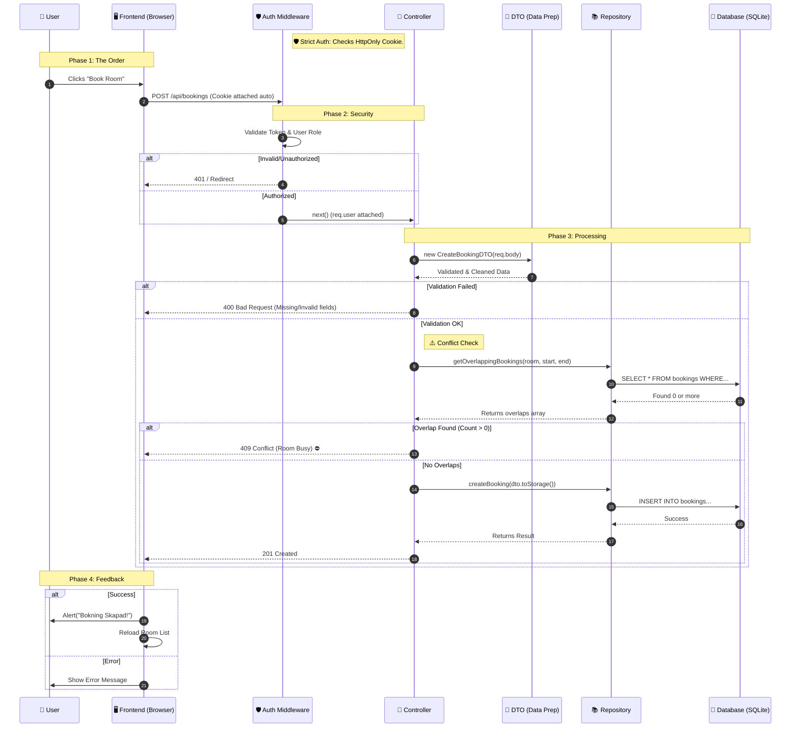
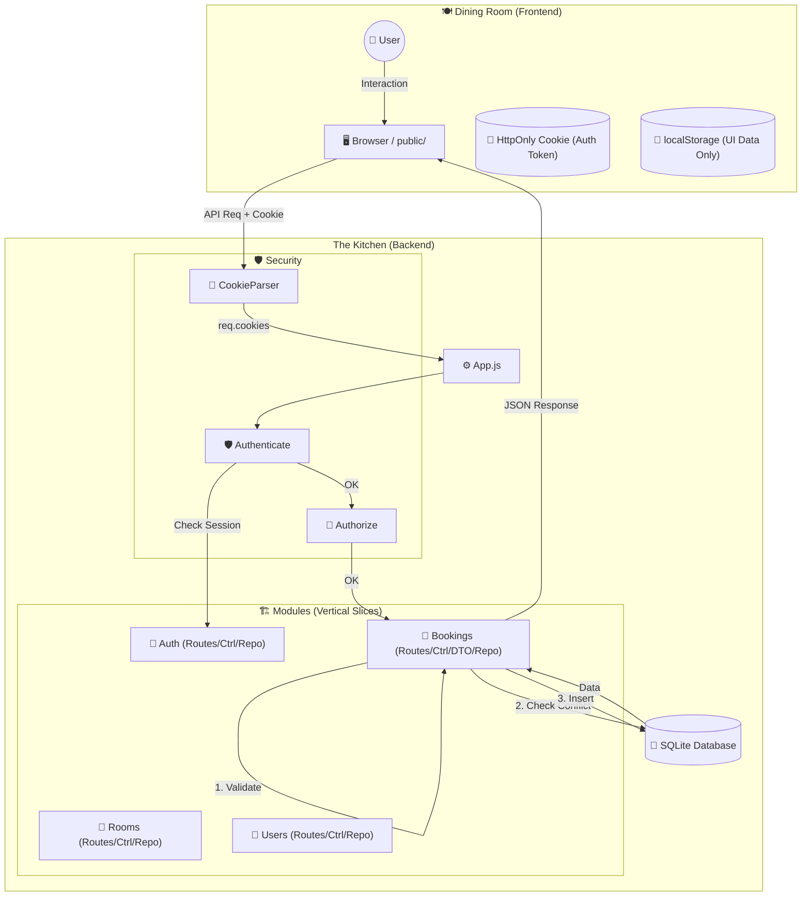

# App Sequence Diagram (Who talks to who?)

```mermaid
sequenceDiagram
    autonumber
    participant User as 👤 User
    participant Frontend as 🖥️ Frontend (Browser)
    participant Auth as 🛡️ Auth Middleware
    participant Controller as 🤵 Controller
    participant DTO as 📝 DTO (Data Prep)
    participant Repo as 📚 Repository
    participant DB as 💽 Database (SQLite)

    Note right of Auth: 🛡️ Strict Auth: Checks HttpOnly Cookie.

    Note over User, Frontend: Phase 1: The Order
    User->>Frontend: Clicks "Book Room"
    Frontend->>Auth: POST /api/bookings (Cookie attached auto)

    Note over Auth, Controller: Phase 2: Security
    Auth->>Auth: Validate Token & User Role
    alt Invalid/Unauthorized
        Auth-->>Frontend: 401 / Redirect
    else Authorized
        Auth->>Controller: next() (req.user attached)
    end

    Note over Controller, DB: Phase 3: Processing
    Controller->>DTO: new CreateBookingDTO(req.body)
    DTO-->>Controller: Validated & Cleaned Data
    
    alt Validation Failed
        Controller-->>Frontend: 400 Bad Request (Missing/Invalid fields)
    else Validation OK
        Note right of Controller: ⚠️ Conflict Check
        Controller->>Repo: getOverlappingBookings(room, start, end)
        Repo->>DB: SELECT * FROM bookings WHERE...
        DB-->>Repo: Found 0 or more
        Repo-->>Controller: Returns overlaps array

        alt Overlap Found (Count > 0)
            Controller-->>Frontend: 409 Conflict (Room Busy) ⛔
        else No Overlaps
            Controller->>Repo: createBooking(dto.toStorage())
            Repo->>DB: INSERT INTO bookings...
            DB-->>Repo: Success
            Repo-->>Controller: Returns Result
            Controller-->>Frontend: 201 Created
        end
    end

    Note over Frontend, User: Phase 4: Feedback
    alt Success
        Frontend->>User: Alert("Bokning Skapad!")
        Frontend->>Frontend: Reload Room List
    else Error
        Frontend->>User: Show Error Message
    end
```

# The Architecture Diagram (Physical Structure)

```mermaid
graph TD
    subgraph Client ["🍽️ Dining Room (Frontend)"]
        User((👤 User))
        Browser["🖥️ Browser / public/"]
        Cookie[("🍪 HttpOnly Cookie (Auth Token)")]
        LS[("💾 localStorage (UI Data Only)")]
    end

    subgraph Server ["The Kitchen (Backend)"]
        App["⚙️ App.js"]

        subgraph Modules ["🏗️ Modules (Vertical Slices)"]
            AuthMod["🔐 Auth (Routes/Ctrl/Repo)"]
            BookMod["📅 Bookings (Routes/Ctrl/DTO/Repo)"]
            RoomMod["🏫 Rooms (Routes/Ctrl/Repo)"]
            UserMod["👥 Users (Routes/Ctrl/Repo)"]
        end

        subgraph Middleware ["🛡️ Security"]
            CP["🍪 CookieParser"]
            AuthN["🛡️ Authenticate"]
            AuthZ["👮 Authorize"]
        end

        DB[("💽 SQLite Database")]
    end

    %% Connections
    User -- Interaction --> Browser
    Browser -- API Req + Cookie --> CP
    CP -- req.cookies --> App
    App --> AuthN
    AuthN -- Check Session --> AuthMod
    AuthN -- OK --> AuthZ
    AuthZ -- OK --> BookMod
    
    BookMod -- 1. Validate --> BookMod
    BookMod -- 2. Check Conflict --> DB
    BookMod -- 3. Insert --> DB

    DB -- Data --> BookMod
    BookMod -- JSON Response --> Browser
```
